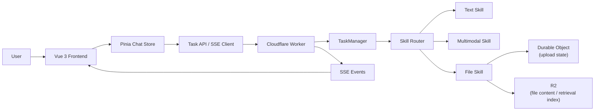

# AI Tool Chat

一个面向作品集和真实工程场景的 AI 对话平台：前端是 Vue 3 单页聊天工作台，后端是 Cloudflare Worker 编排层，支持流式对话、图片理解、文件上传、断点续传，以及普通文本文件的检索优先分析。

## Demo / 素材

- 在线地址：[https://i-tool-chat.store](https://i-tool-chat.store)
- API 地址：[https://api.i-tool-chat.store](https://api.i-tool-chat.store)
- 演示素材目录：[`docs/assets/`](./docs/assets/)

当前仓库已经预留素材目录，你可以把录屏/GIF/截图放到这里后直接补到本 README：

- `docs/assets/chat-overview.png`
- `docs/assets/streaming-demo.gif`
- `docs/assets/file-upload-demo.gif`
- `docs/assets/architecture.png`

## 这不是普通聊天 Demo 的原因

这个项目不是“前端页面 + 一个模型 API”的简单套壳，而是做了完整的产品主链路和工程约束：

- `Task -> Step -> Skill` 编排，而不是单接口直连模型
- SSE 流式事件不仅返回内容，还返回任务步骤和错误状态
- 文件上传走分片上传、断点续传、Durable Object 状态恢复、R2 正文存储
- 普通文本文件默认走“检索优先”，把大文件分析 token 从全文级别压到少量相关片段
- 前端已经收口成单一 Task 主链路，消息、步骤、流式内容和会话状态都由 Store 管理

## 核心亮点

### 1. 任务流可视化

后端不是只返回最终文本，而是把一次请求拆成多个步骤，让前端能直接展示 AI 当前在做什么：

- `task`
- `step`
- `content`
- `error`
- `complete`

### 2. 大文件上传与断点续传

- 文件上传使用稳定 `fileId`
- 上传前查询服务端已收分片，只补传缺失部分
- Durable Object 只保存元数据和分片状态
- 合并后的正文写入 R2，避免大文本触发 DO 单值存储上限

### 3. 普通文本文件检索优先

普通文本文件不再默认全文丢进模型，而是：

1. 服务端读取文件正文
2. 切成稳定文本块
3. 根据问题做相关性打分
4. 只取少量高相关片段进入模型
5. 仅在概览型问题或检索不足时回退到全文摘要

这个策略直接解决了大文件场景下的 token 成本和响应时间问题。

### 4. 前后端工程闭环

- 前端：`lint + build + vitest`
- Worker：`vitest + wrangler deploy --dry-run`
- 根目录统一命令：`pnpm check`
- GitHub Actions 已加入 `verify` 工作流，用于 PR / push 验证

## 架构概览



## 目录结构

```text
ai-tool-chat/
├─ packages/
│  ├─ frontend/   # Vue 3 + TypeScript + Pinia + Vite
│  └─ worker/     # Cloudflare Worker + Task/Step/Skill + SSE
├─ docs/
│  ├─ adr/
│  ├─ assets/
│  ├─ plans/
│  └─ reference/
├─ AGENTS.md
└─ README.md
```

## 关键技术问题与解法

### 1. 如何避免聊天主链路状态分散

做法：

- 前端统一收口到 `ChatStore`
- 页面不再绕过 Store 直接发请求
- `Task / Step / streaming content / session loading` 都由 Store 统一管理

### 2. 如何让大文件上传可恢复

做法：

- 前端按分片上传
- 上传前先查 `/upload/status`
- 前端只补传缺失分片
- Worker 在合并前会校正 metadata，修复缺片状态

### 3. 如何避免 Durable Object 存大文本失败

做法：

- DO 只存上传状态和完成标记
- 文件正文写入 R2
- 文件分析阶段按 `fileId` 从 R2 读取正文

### 4. 如何压低普通文本文件分析 token

做法：

- 默认检索优先，不默认全文摘要
- 设置 `topK` 和最大 prompt token 预算
- 连续提问命中同一文件的检索索引缓存

## 技术栈

### Frontend

- Vue 3
- TypeScript
- Pinia
- Vue Router
- Vite
- Markdown-It
- Vitest

### Worker

- Cloudflare Workers
- Wrangler
- SSE
- Durable Objects
- R2
- Vitest

## 本地运行

### 1. 安装依赖

```bash
pnpm install
```

### 2. 配置 Worker 环境变量

参考 [`packages/worker/.dev.vars.example`](./packages/worker/.dev.vars.example)：

```bash
DEFAULT_MODEL=qwen3.5-flash-2026-02-23
DEFAULT_MULTIMODAL_MODEL=qwen3.5-plus
QWEN_API_KEY=your_qwen_key
```

常见可选变量：

- `GLM_API_KEY`
- `QWEN_API_KEY`
- `OPENAI_API_KEY`
- `DEEPSEEK_API_KEY`
- `DEFAULT_MODEL`
- `DEFAULT_MULTIMODAL_MODEL`

### 3. 启动开发环境

前端：

```bash
pnpm --filter @ai-tool-chat/frontend dev
```

Worker：

```bash
pnpm --filter @ai-tool-chat/worker dev
```

默认地址：

- Frontend: [http://localhost:5173](http://localhost:5173)
- Worker: [http://127.0.0.1:8787](http://127.0.0.1:8787)

## 工程验证

### 根目录统一检查

```bash
pnpm check
```

### 分包命令

前端：

```bash
pnpm --filter @ai-tool-chat/frontend lint
pnpm --filter @ai-tool-chat/frontend build
pnpm --filter @ai-tool-chat/frontend test
```

Worker：

```bash
pnpm --filter @ai-tool-chat/worker test
pnpm --filter @ai-tool-chat/worker exec wrangler deploy --dry-run
```

## 排障入口

先看 Worker 结构化日志里的这些字段：

- `route`
- `requestType`
- `taskId`
- `fileId`
- `skill`
- `model`
- `durationMs`
- `errorCode`

详细排障手册：

- [`docs/reference/ERROR_LOG.md`](./docs/reference/ERROR_LOG.md)

## 当前边界

### 工具调用

`enableTools` 目前仍是实验能力标记，仓库内已经预留 MCP 结构，但产品主链路仍然以聊天与文件分析为主。

### Task 生命周期

Task 主要服务于单次请求生命周期中的实时展示，目前不承诺：

- 跨实例一致性
- 长期任务持久化查询
- 跨实例恢复

详细说明：

- [`docs/adr/2026-03-29-task-lifecycle-boundary.md`](./docs/adr/2026-03-29-task-lifecycle-boundary.md)

## 简历 / 面试可直接使用的亮点文案

### 30 秒版本

- 独立实现了一个基于 Vue 3 + Cloudflare Worker 的 AI 对话平台，支持 SSE 流式响应、图片理解、文件上传和断点续传。
- 后端采用 `Task -> Step -> Skill` 编排模型，前端可以实时展示 AI 的执行步骤和状态。
- 针对大文本文件做了检索优先改造，把普通文本文件分析从全文摘要改成相关片段注入，显著降低 token 成本并提升响应速度。

### 适合写在简历里的 3 条

1. 设计并实现基于 `Task -> Step -> Skill` 的 AI Worker 编排层，统一处理文本、多模态和文件分析请求，并通过 SSE 实时回传任务步骤与流式内容。
2. 实现大文件分片上传、断点续传与 R2 正文存储方案，使用 Durable Object 管理上传状态，解决大文本文件在 Worker 环境下的合并与恢复问题。
3. 将普通文本文件分析从全文摘要重构为“检索优先”链路，结合切块、相关性打分与缓存索引，有效降低 token 消耗并缩短文件问答响应时间。

## 相关文档

- [`AGENTS.md`](./AGENTS.md)
- [`docs/reference/ERROR_LOG.md`](./docs/reference/ERROR_LOG.md)
- [`docs/plans/2026-03-29-task-pipeline-unification.md`](./docs/plans/2026-03-29-task-pipeline-unification.md)

## License

MIT
