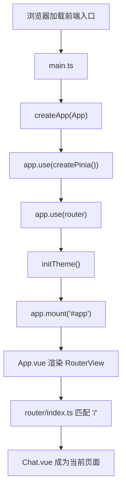
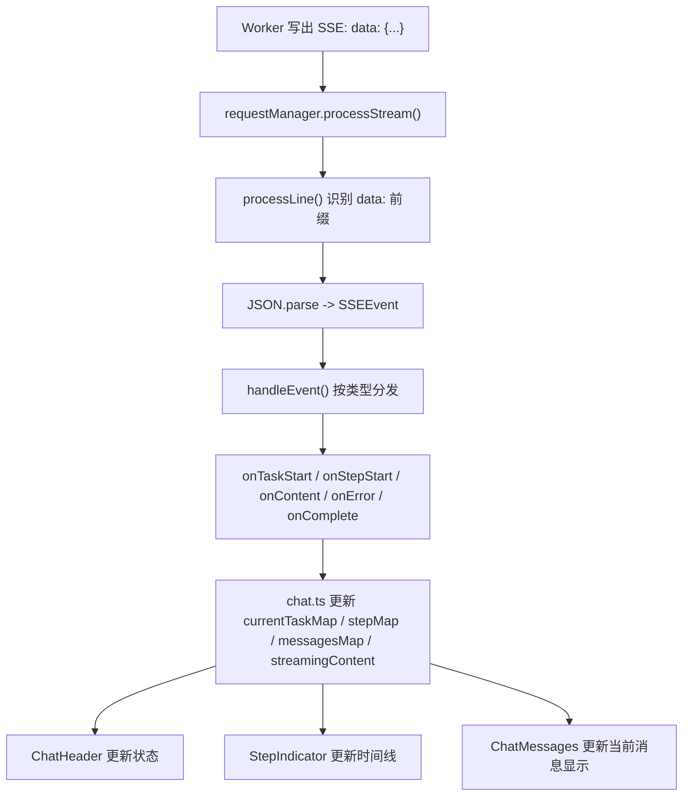

# 前端代码学习指南

> 这份文档写给“前端基础还不稳，但愿意跟着真实项目学”的你。  
> 目标不是让你背概念，而是让你能顺着当前仓库，真正看懂这个前端为什么这样写。

## 先给结论

如果你前端基础还比较弱，**最适合这个项目的学习方式不是下面两种极端**：

- 先把所有前端基础学完，再来看项目
- 前端后端完全并行，一上来一起硬啃

这两个方式都容易卡住：

- 第一种会拖太久，学了很多抽象知识，但一落到项目还是不会串起来
- 第二种信息量太大，你会同时被 Vue、状态管理、接口、SSE、Worker 搞晕

**这个项目最适合的路线是：前端主线 + 后端辅助。**

也就是：

1. 先看前端页面怎么跑起来
2. 再看一次发送消息时，前端怎么组织状态
3. 到“请求发送”“流式响应”“步骤状态”这几个关键位置时，再补最少的后端知识

这样学的好处是：

- 你始终知道自己正在看“页面为什么这么显示”
- 你不会把后端当成黑盒死记硬背
- 你能建立一条完整链路：`页面 -> Store -> 请求 -> Worker -> SSE -> 页面`

## 这份文档怎么使用

建议你按顺序读，不要跳着看。

- 第 1 遍：只追主链路，先搞懂“消息怎么发出去，又怎么回到页面”
- 第 2 遍：再补细节，比如 `Pinia`、`ReadableStream`、`watch`
- 第 3 遍：对照代码自己走一遍，最好边读边打开对应文件

如果你读到某个地方感觉抽象，不要立刻去补整本前端教程，先看这份文档第 8 章“只补和本项目直接相关的前端基础”。

另外，这份文档只把后端解释到“够你看懂前端”为止。  
如果你想深入 Worker、上传、检索、R2、Durable Object，再看：

- [`docs/backend-learning-guide.md`](./backend-learning-guide.md)

---

## 1. 先搞清楚这个前端到底在干什么

### 这一章解决什么问题

你首先要回答的不是“Vue 怎么写”，而是：

**这个前端到底在解决什么业务问题？**

如果把这件事说简单一点，这个前端不是普通静态页面，而是一个“聊天工作台”：

- 左边管理会话列表
- 中间展示消息流
- 底部输入消息、图片、文件
- 上方展示当前任务和步骤状态
- 在 AI 回复时，页面会边收边显示，不是等整个结果结束后一次性出现

所以它至少同时做了 4 件事：

1. 渲染界面
2. 管理聊天状态
3. 向后端发请求
4. 接收后端的流式事件并实时刷新 UI

也就是说，这不是一个“点按钮 -> 调接口 -> 拿 JSON -> 渲染”的普通页面，而是一个**持续收消息、持续更新状态**的前端。

### 先看哪个文件

- [`packages/frontend/src/views/Chat.vue`](../packages/frontend/src/views/Chat.vue)
- [`packages/frontend/src/components/ChatMessages.vue`](../packages/frontend/src/components/ChatMessages.vue)
- [`packages/frontend/src/components/ChatInput.vue`](../packages/frontend/src/components/ChatInput.vue)
- [`packages/frontend/src/components/StepIndicator.vue`](../packages/frontend/src/components/StepIndicator.vue)

### 代码里要关注哪些逻辑

先只看结构，不要着急看细节：

- `Chat.vue` 是聊天页主骨架
- `ChatMessages.vue` 负责显示欢迎页或消息列表
- `ChatInput.vue` 负责输入区和附件区
- `StepIndicator.vue` 负责显示任务步骤和状态摘要

你要先建立一个朴素认识：

- `Chat.vue` 像一个总装车间
- 每个组件只负责一部分 UI
- 真正的聊天状态不保存在某一个组件里，而是统一放在 Store 里

### 初学者常见误区

- 误区 1：把这个项目理解成“几个 Vue 组件拼起来”
  实际上它的核心不是组件，而是“状态 + 数据流”
- 误区 2：觉得页面上的内容都是组件自己算出来的
  实际上很多内容来自 Store，Store 又依赖后端 SSE 事件
- 误区 3：一上来就看 CSS 或细节交互
  先抓主链路，不然会陷进样式细节里

### 读完自测题

- 这个前端和普通静态页面最大的区别是什么？
- 为什么它不能只靠组件内部状态完成？
- 页面上“生成中”“第几步”“逐字输出”分别说明了什么？

---

## 2. 从启动入口开始：Vue 应用是怎么跑起来的

### 这一章解决什么问题

这一章要解决的是：

**浏览器打开页面后，代码是怎么一步一步走到聊天页的？**

很多初学者看 Vue 项目时，第一反应是“组件太多，不知道从哪进”。  
其实入口顺序很固定：

`main.ts -> App.vue -> router -> Chat.vue`

### 先看哪个文件

- [`packages/frontend/src/main.ts`](../packages/frontend/src/main.ts)
- [`packages/frontend/src/App.vue`](../packages/frontend/src/App.vue)
- [`packages/frontend/src/router/index.ts`](../packages/frontend/src/router/index.ts)
- [`packages/frontend/src/views/Chat.vue`](../packages/frontend/src/views/Chat.vue)

### Vue 启动流程图



### 代码里要关注哪些逻辑

#### 2.1 `main.ts` 在做什么

`main.ts` 是整个前端的启动入口。你可以把它理解成“开机脚本”。

它主要做了几件事：

- 导入全局样式 `./style.css`
- 创建 Vue 应用：`createApp(App)`
- 注册 Pinia：`app.use(createPinia())`
- 注册路由：`app.use(router)`
- 初始化主题：`initTheme()`
- 挂载到页面：`app.mount('#app')`

除此之外，它还做了一些“应用级”工作：

- 检查本地存储是否可用
- 检查网络状态
- 挂全局错误监听
- 在开发环境打印性能日志

你现在不需要把这些全记住，但要知道：

**`main.ts` 负责准备运行环境，不负责聊天业务。**

#### 2.2 `App.vue` 为什么这么薄

`App.vue` 很简单，主要就是渲染 `<RouterView />`。

这表示：

- `App.vue` 是顶层壳
- 真正当前要显示哪个页面，不由它决定
- 而是由 Vue Router 决定

#### 2.3 `router/index.ts` 在做什么

路由文件里只有一个主要路由：

- 路径 `/`
- 对应页面 `Chat.vue`

这意味着现在这个前端本质上是一个单页聊天应用。  
你访问根路径，最终看到的就是聊天页。

#### 2.4 `Chat.vue` 为什么重要

因为它是“聊天工作台”的真正页面入口。

你后面读组件时，可以一直记住：

- `main.ts` 负责启动
- `App.vue` 负责留一个页面插槽
- `router` 负责决定显示哪个页面
- `Chat.vue` 才开始进入聊天业务

### 初学者常见误区

- 误区 1：以为 `App.vue` 一定要写很多业务
  在很多项目里，`App.vue` 只负责提供顶层壳和路由出口
- 误区 2：看见 `app.use(...)` 就慌
  你先把它理解成“给整个应用注册能力”就够了
- 误区 3：分不清“页面”和“组件”
  `Chat.vue` 是页面，`ChatInput.vue` 这种是页面里的组件

### 读完自测题

- 浏览器打开页面后，最先执行哪个文件？
- `App.vue` 和 `Chat.vue` 的职责有什么区别？
- 为什么 `router/index.ts` 现在可以很简单？

---

## 3. 页面骨架和组件职责：聊天页是怎么拼出来的

### 这一章解决什么问题

这一章要回答：

**聊天页上看到的这些区域，分别是谁负责渲染的？它们怎么配合？**

### 先看哪个文件

- [`packages/frontend/src/views/Chat.vue`](../packages/frontend/src/views/Chat.vue)
- [`packages/frontend/src/components/Sidebar.vue`](../packages/frontend/src/components/Sidebar.vue)
- [`packages/frontend/src/components/ChatHeader.vue`](../packages/frontend/src/components/ChatHeader.vue)
- [`packages/frontend/src/components/ChatMessages.vue`](../packages/frontend/src/components/ChatMessages.vue)
- [`packages/frontend/src/components/StepIndicator.vue`](../packages/frontend/src/components/StepIndicator.vue)
- [`packages/frontend/src/components/ChatInput.vue`](../packages/frontend/src/components/ChatInput.vue)

### 代码里要关注哪些逻辑

`Chat.vue` 的模板里有一条很清晰的页面骨架：

- 左侧：`Sidebar`
- 中间上方：`ChatHeader`
- 中间主体：`ChatMessages`
- 底部：`StepIndicator + ChatInput`

你可以把 `Chat.vue` 看成一个布局总控组件。  
它主要做三类事情：

1. 组织布局
2. 从 Store 取当前任务和步骤
3. 把用户动作转发给 Store

#### 3.1 `Sidebar` 负责什么

`Sidebar.vue` 负责：

- 显示品牌信息
- 创建新会话
- 列出历史会话
- 切换当前会话
- 删除会话
- 切换主题

也就是说，左边栏不是“样式摆设”，而是会话管理中心。

#### 3.2 `ChatHeader` 负责什么

`ChatHeader.vue` 负责：

- 显示当前会话标题
- 显示当前任务状态
- 显示当前模型标签
- 清空当前对话
- 在移动端切换侧边栏

你在页面上看到的“执行中”“已完成”“需重试”这类状态，不是组件自己猜的，而是根据 Store 中的任务状态算出来的。

#### 3.3 `ChatMessages` 负责什么

`ChatMessages.vue` 负责：

- 没消息时显示欢迎页
- 有消息时显示消息列表
- 在长对话场景下处理滚动
- 在流式输出时自动滚动到底部

这里你会第一次看到：  
**显示中的消息内容，不一定等于真正保存在 `messages` 数组里的内容。**

因为流式输出时，它会把 `streamingContent` 合并进当前消息的展示结果。

#### 3.4 `StepIndicator` 负责什么

它不是聊天内容本身，而是任务可视化。

它负责展示：

- 当前用的模型
- 当前任务状态
- 当前正在执行哪一步
- 已完成多少步
- 展开后显示完整步骤时间线

这部分之所以存在，是因为后端不是只返回最终文本，而是把整个 Task 过程拆成了 Step 事件。

#### 3.5 `ChatInput` 负责什么

它负责：

- 输入文本
- 添加图片
- 添加文件
- 显示输入状态
- 发送消息
- 正在生成时提供停止按钮

但要注意：  
**它不直接自己发请求给后端。**  
它更像“收集输入并抛出事件”，真正发送逻辑在 Store。

### 初学者常见误区

- 误区 1：觉得“哪个组件上有按钮，逻辑就一定写在这个组件里”
  实际上按钮只是触发点，业务逻辑往往在更上层或 Store
- 误区 2：把 `StepIndicator` 当成无关紧要的装饰
  它恰恰是在暴露前后端任务链路
- 误区 3：看到多个组件就以为状态会很分散
  这个项目特意把聊天主状态收口到了 Store

### 读完自测题

- `Chat.vue` 的核心职责是布局、状态管理还是请求发送？
- 为什么 `ChatInput.vue` 不适合直接管理所有聊天状态？
- `ChatMessages.vue` 为什么要关心 `streamingContent`？

---

## 4. 前端最关键的一层：Store 为什么是主脑

### 这一章解决什么问题

这一章是整份文档最重要的部分。  
它要解决的是：

**为什么聊天应用不能把状态散落在各个组件里，而要集中到 Store？**

### 先看哪个文件

- [`packages/frontend/src/stores/chat.ts`](../packages/frontend/src/stores/chat.ts)
- [`packages/frontend/src/stores/chatStorage.ts`](../packages/frontend/src/stores/chatStorage.ts)
- [`packages/frontend/src/stores/chatRuntime.ts`](../packages/frontend/src/stores/chatRuntime.ts)
- [`packages/frontend/src/stores/chatRequest.ts`](../packages/frontend/src/stores/chatRequest.ts)
- [`packages/frontend/src/types/task.ts`](../packages/frontend/src/types/task.ts)

### 代码里要关注哪些逻辑

#### 4.1 先把 Pinia 理解成什么

Pinia 是 Vue 常用的状态管理工具。  
你先不用把它理解得很复杂，当前项目里你把它理解成：

**一个全局共享的状态仓库。**

也就是说：

- `Sidebar` 能读会话列表
- `ChatHeader` 能读当前任务状态
- `ChatMessages` 能读消息列表和流式内容
- `ChatInput` 能知道当前是否正在生成

这些组件不需要互相层层传值，它们都可以通过同一个 Store 取状态。

#### 4.2 `chat.ts` 里到底放了哪些状态

这个 Store 里最重要的几组状态是：

- `sessionList`
  所有会话的概要信息
- `messagesMap`
  每个会话对应的消息列表
- `currentSessionId`
  当前正在看的会话
- `sessionLoadingMap`
  某个会话当前是否还在生成
- `currentTaskMap`
  某个会话当前对应的 Task
- `stepMap`
  某个会话当前收到的 Step 列表
- `streamingContent`
  当前界面正在流式显示的那段内容
- `abortController`
  用来中止当前请求

这就是这个项目的核心心智模型：

**UI 不是直接围着“组件状态”转，而是围着“会话状态 + 任务状态 + 流式状态”转。**

#### 4.3 为什么不是只存一个 `messages`

因为这是多会话应用。

如果只存一个数组：

- 你一切换会话就会丢上下文
- 不同会话的数据会互相覆盖

所以项目采用的是：

- `messagesMap[sessionId] = 当前会话的消息数组`

这是一种很典型的“按业务主键存状态”的方式。

#### 4.4 为什么还要有 `currentTaskMap` 和 `stepMap`

因为这个项目不只是聊天内容展示，还要展示“当前任务正在做什么”。

后端会返回：

- 当前 Task 的状态
- 每个 Step 的开始、完成、失败

所以前端必须给这些运行态单独留位置，而不是硬塞到消息数组里。

#### 4.5 类型为什么重要

请重点看 [`packages/frontend/src/types/task.ts`](../packages/frontend/src/types/task.ts)。

这个文件里最重要的几类数据合同是：

- `ChatMessage`
  一条消息的最小结构，只关心 `role` 和 `content`
- `Task`
  一次完整请求的运行对象
- `Step`
  Task 执行过程中的一个步骤
- `SSEEvent`
  后端通过流式通道发来的事件外壳
- `TaskRequest`
  前端发送请求时使用的结构，在 [`packages/frontend/src/api/requestManager.ts`](../packages/frontend/src/api/requestManager.ts) 里定义

你要把它们理解成：

**前后端对齐的数据合同。**

也就是说，前端之所以会有 `currentTaskMap / stepMap / streamingContent`，不是前端随便设计的，而是因为后端返回的数据就长这样。

### 初学者常见误区

- 误区 1：把 Store 当成“可有可无的高级写法”
  聊天类应用里，Store 基本是核心骨架
- 误区 2：只关注 `messages`，忽略任务状态
  这样会看不懂为什么还有步骤条、状态标识、停止生成
- 误区 3：觉得类型文件只是 TypeScript 装饰
  实际上类型文件是在定义前后端的通信协议

### 读完自测题

- 为什么这个项目需要 `messagesMap`，而不是一个单独的 `messages`？
- `currentTaskMap` 和 `stepMap` 分别在描述什么？
- 为什么说 `types/task.ts` 是“前后端数据合同”？

---

## 5. 发送一次消息到底发生了什么

### 这一章解决什么问题

这一章要回答最关键的问题：

**你在输入框里点击发送之后，到底发生了什么？**

这条链路你必须能背出来：

`ChatInput -> Chat.vue -> chat store -> requestManager -> Worker -> SSE -> store -> 组件刷新`

### 先看哪个文件

- [`packages/frontend/src/components/ChatInput.vue`](../packages/frontend/src/components/ChatInput.vue)
- [`packages/frontend/src/views/Chat.vue`](../packages/frontend/src/views/Chat.vue)
- [`packages/frontend/src/stores/chat.ts`](../packages/frontend/src/stores/chat.ts)
- [`packages/frontend/src/stores/chatRequest.ts`](../packages/frontend/src/stores/chatRequest.ts)
- [`packages/frontend/src/api/task.ts`](../packages/frontend/src/api/task.ts)
- [`packages/frontend/src/api/requestManager.ts`](../packages/frontend/src/api/requestManager.ts)

### 发送消息流程图

```mermaid
flowchart LR
  A["用户在 ChatInput 输入内容"] --> B["点击发送 / 按快捷键发送"]
  B --> C["ChatInput emit('send', content, images, files)"]
  C --> D["Chat.vue 的 handleSend()"]
  D --> E["store.sendTaskMessage(...)"]
  E --> F["构造用户消息并写入 messagesMap"]
  F --> G["先插入一个空 assistant 消息占位"]
  G --> H["sendTaskRequest(...)"]
  H --> I["TaskRequestManager.fetch(...)"]
  I --> J["Worker 返回 SSE 流"]
  J --> K["requestManager 逐条解析事件"]
  K --> L["onTask / onStep / onContent / onError / onComplete"]
  L --> M["Store 更新 task、step、streamingContent、messages"]
  M --> N["ChatHeader / ChatMessages / StepIndicator 自动刷新"]
```



### 代码里要关注哪些逻辑

#### 5.1 `ChatInput.vue` 并不直接请求后端

它通过 `emit('send', ...)` 把内容交给父组件。

这一步很重要，因为它说明：

- 输入组件负责收集用户输入
- 但真正的业务动作不是它自己说了算
- 这样组件就更容易复用，也更容易维护

#### 5.2 `Chat.vue` 做的是转发

`Chat.vue` 里的 `handleSend()` 会调用：

- `store.sendTaskMessage(content, images, files)`

它扮演的是页面协调者，而不是底层请求执行者。

#### 5.3 `sendTaskMessage()` 是主链路核心

请重点读 [`packages/frontend/src/stores/chat.ts`](../packages/frontend/src/stores/chat.ts) 里的 `sendTaskMessage()`。

这个函数大致做了下面这些事情：

1. 检查当前会话是否有效
2. 检查当前会话是否已经在生成中
3. 组装用户消息内容
4. 把用户消息先加入消息列表
5. 预先插入一条空的 `assistant` 消息
6. 创建 `AbortController`
7. 把会话状态切到 loading
8. 清空旧的 Task、Step、流式内容
9. 调用 `sendTaskRequest(...)`
10. 在各种回调里持续更新状态
11. 最后收尾，关闭 loading，保存到本地

这里最值得你学习的设计是第 5 步：

**为什么先插入一条空的 assistant 消息？**

因为流式内容回来时，前端需要一个“正在被填充的目标位置”。  
否则它不知道把后续文字追加到哪条消息上。

#### 5.4 `chatRequest.ts` 的作用是什么

它负责构造发给后端的消息数组。

你可以把它理解成：

- 页面里的消息很多
- 但发请求时，只需要一套干净的历史消息格式

所以这里做了一个“请求前整理”：

- 去掉无关项
- 只保留 `{ role, content }`
- 把当前用户消息拼到历史后面

#### 5.5 `api/task.ts` 为什么只是一层薄封装

它只是把 `TaskRequestManager` 包了一层，保留旧入口：

- `sendTaskRequest(...)`

真正重要的是下一层 `requestManager.ts`。

#### 5.6 `requestManager.ts` 真正在做什么

它统一处理：

- 发送 `fetch`
- 读取响应流
- 按行解析 SSE
- 把不同事件分发给不同回调

最重要的几个方法是：

- `send()`
  负责发起请求
- `processStream()`
  负责持续读取 `ReadableStream`
- `processLine()`
  负责识别 `data: ...`
- `handleEvent()`
  负责把事件转成 `onTaskStart / onStepStart / onContent ...`

你可以把它理解成：

**前端自己的 SSE 客户端。**

### 初学者常见误区

- 误区 1：以为 `fetch` 返回后就拿到完整结果了
  这里拿到的是流，内容还会持续到来
- 误区 2：看不懂为什么要有这么多回调
  因为不同事件对应不同 UI 更新
- 误区 3：看不懂“空 assistant 消息”
  它本质上是流式输出的占位容器

### 读完自测题

- 发送按钮真正触发后，第一层业务函数是谁？
- 为什么 `sendTaskMessage()` 要先插入空的助手消息？
- `requestManager.ts` 和普通 `fetch(...).json()` 最大的区别是什么？

---

## 6. 第一次接入后端视角：为什么前端会收到这些事件

### 这一章解决什么问题

到这里你已经知道前端会收到 `task / step / content / error / complete`。  
现在要补的不是全部后端细节，而是：

**这些事件到底是后端哪一层发出来的？**

### 先看哪个文件

- [`packages/worker/src/index.ts`](../packages/worker/src/index.ts)
- [`packages/worker/src/handlers/chatHandlers.ts`](../packages/worker/src/handlers/chatHandlers.ts)
- [`packages/worker/src/core/taskManager.ts`](../packages/worker/src/core/taskManager.ts)
- [`packages/worker/src/core/taskStepRunner.ts`](../packages/worker/src/core/taskStepRunner.ts)
- [`packages/worker/src/skills/index.ts`](../packages/worker/src/skills/index.ts)

### 代码里要关注哪些逻辑

#### 6.1 从入口路由开始

在 Worker 里，请求先进入 `index.ts`。

当路径是 `/chat` 时，会走到：

- `handleChatRequest(request, env)`

这一步只负责把请求送进聊天主链路。

#### 6.2 `chatHandlers.ts` 做了什么

它主要做三件事：

1. 校验请求体
2. 创建 TaskManager 和 Task
3. 决定走流式还是非流式

默认情况下，它走流式路径。  
流式路径里最关键的一行思想是：

- `for await (const event of taskManager.executeTask(...))`

也就是说，TaskManager 每产出一个事件，`chatHandlers.ts` 就把它包装成 SSE 写回前端。

#### 6.3 `TaskManager` 负责什么

`TaskManager` 自己并不生成最终内容，它负责的是：

- 创建任务
- 启动执行
- 产出任务级事件
- 委托 `TaskStepRunner` 去跑步骤

它会先发出：

- `task started`

然后把执行权交给 `stepRunner.run(...)`。

#### 6.4 `TaskStepRunner` 负责什么

它是真正的步骤编排器。

从当前实现看，主链路大致是：

1. 计划步骤 `plan`
2. 执行技能步骤 `skill`
3. 响应步骤 `respond`
4. 最后发出 `complete`

在 `skill` 步骤执行过程中，如果模型持续吐内容，它会不断 `yield`：

- `content` 事件

这就是前端逐字显示内容的直接来源。

#### 6.5 `skills/index.ts` 为什么重要

它决定“这次请求该用哪个 Skill”。

大致规则是：

- 有图片 -> 多模态
- 有文件 -> 文件分析
- 纯文本 -> 文本 Skill

所以前端看到的“模型标签”“任务类型”“步骤说明”，很多都和这里的 Skill 选择有关。

### 这一章你只需要记住的后端主链路

```text
前端 POST /chat
  -> worker/src/index.ts
  -> handlers/chatHandlers.ts
  -> TaskManager
  -> TaskStepRunner
  -> selectSkill()
  -> Skill 执行
  -> 不断产出 SSE 事件
  -> 前端 requestManager 逐条消费
```

如果你现在的目标只是看懂前端，到这里就够了。  
更深的 Worker 细节请继续看：

- [`docs/backend-learning-guide.md`](./backend-learning-guide.md)

### 初学者常见误区

- 误区 1：以为后端只返回一坨最终字符串
  这个项目返回的是事件流
- 误区 2：把 Task、Step、Skill 当成前端概念
  它们本质上是后端编排模型，前端只是消费它们
- 误区 3：觉得前端状态设计很“绕”
  实际上它是在映射后端的事件结构

### 读完自测题

- 前端收到的 `step` 事件是在后端哪一层产生的？
- `content` 事件为什么会不断到来，而不是只来一次？
- `Skill` 选择和前端 UI 展示有什么关系？

---

## 7. 流式渲染和界面刷新：为什么消息会一字一字出现

### 这一章解决什么问题

这一章要解决：

**为什么 AI 回复不是最后一起出现，而是像打字一样逐步显示？**

### 先看哪个文件

- [`packages/frontend/src/api/requestManager.ts`](../packages/frontend/src/api/requestManager.ts)
- [`packages/frontend/src/stores/chat.ts`](../packages/frontend/src/stores/chat.ts)
- [`packages/frontend/src/components/ChatMessages.vue`](../packages/frontend/src/components/ChatMessages.vue)

### SSE 事件流转图



### 代码里要关注哪些逻辑

#### 7.1 `onContent` 是怎么工作的

在 `chat.ts` 里，`onContent` 回调每收到一个内容片段，就会：

- 找到当前会话里那个空的 assistant 消息
- 把新片段追加到它的 `content`
- 如果当前页面正显示这个会话，再同步更新 `streamingContent`

所以你看到的“逐字输出”，本质上是：

- 后端持续发片段
- 前端持续把片段 append 到同一条消息上

#### 7.2 为什么还要有 `streamingContent`

因为这个项目做了一个区分：

- `messagesMap` 是会话级持久消息
- `streamingContent` 是当前展示层的实时流式态

它的意义是：

- 当前正在看的会话，可以立刻看到更平滑的流式更新
- 切换会话时，可以单独清理当前显示态
- 不需要把所有展示逻辑都绑定在组件局部状态里

你可以把它理解成：

**为当前屏幕显示优化的一层临时运行态。**

#### 7.3 `ChatMessages.vue` 怎么把它显示出来

`displayMessages` 这个计算属性会做一件关键事：

- 如果某条消息正好是当前流式输出那条消息
- 就用 `streamingContent.content` 覆盖展示内容

这就是“展示数据”和“底层状态”之间的一层映射。

#### 7.4 为什么切换会话要清理流式显示态

在 `Chat.vue` 里有一个 `watch`：

- 监听 `store.currentSessionId`
- 切换会话时清理 `store.clearStreamingContent()`

如果不清理，会有两个问题：

- 你可能把 A 会话的流式显示错带到 B 会话
- 当前界面的显示态和真正会话状态会混在一起

### 初学者常见误区

- 误区 1：认为“流式显示”只是 CSS 动画
  它本质上是数据一段段进来
- 误区 2：以为只更新 `messagesMap` 就够了
  当前界面往往还需要单独的运行态
- 误区 3：看不懂 `computed` 为什么要重新组装 `displayMessages`
  因为 UI 展示并不总等于原始状态对象

### 读完自测题

- `streamingContent` 和 `messagesMap` 的区别是什么？
- 为什么切换会话时要清理流式显示态？
- `ChatMessages.vue` 是怎么决定显示哪段内容的？

---

## 8. 只补和这个项目直接相关的前端基础

### 这一章解决什么问题

你现在不需要去补一整套笼统的前端理论。  
你只需要补那些**一旦不会，就看不懂这个项目**的基础。

### 先看哪个文件

- [`packages/frontend/src/views/Chat.vue`](../packages/frontend/src/views/Chat.vue)
- [`packages/frontend/src/stores/chat.ts`](../packages/frontend/src/stores/chat.ts)
- [`packages/frontend/src/api/requestManager.ts`](../packages/frontend/src/api/requestManager.ts)
- [`packages/frontend/src/components/ChatMessages.vue`](../packages/frontend/src/components/ChatMessages.vue)

### 代码里要关注哪些逻辑

#### 8.1 `ref`

你可以把 `ref` 理解成：

- 一个“可变化”的响应式值

项目里常见用法：

- `const isSidebarOpen = ref(false)`
- `const currentSessionId = ref('')`

当 `ref` 的值变化时，依赖它的模板或计算属性会自动更新。

#### 8.2 `computed`

你可以把 `computed` 理解成：

- 根据已有状态推导出来的新状态

例如：

- 当前会话对象
- 当前显示消息列表
- 当前任务状态文字

它适合“从别的状态算出来”的值，而不是直接手动赋值。

#### 8.3 `watch`

`watch` 用来“监听某个值变化后执行副作用”。

项目里最典型的例子是：

- 切换会话后清理流式内容

所以你可以把它理解成：

- `computed` 是算值
- `watch` 是监听变化后做动作

#### 8.4 组件通信：`props / emits`

这个项目里最常见的组件通信方式是：

- 父组件通过 `props` 传数据给子组件
- 子组件通过 `emit` 把事件抛回父组件

例如：

- `Chat.vue` 把 `loading` 传给 `ChatInput`
- `ChatInput` 通过 `emit('send')` 通知父组件发送消息

#### 8.5 Pinia

你现在只要记住它的项目内作用：

- 给多个组件共享聊天状态
- 避免层层传参
- 把业务主链路集中起来

#### 8.6 `fetch`

普通 `fetch` 你可能会写成：

```ts
const data = await fetch(url).then((res) => res.json())
```

但这个项目不是这样，因为返回的是流。

所以它需要：

- `fetch(...)`
- 拿到 `response.body`
- `body.getReader()`
- 持续 `read()`

#### 8.7 `ReadableStream`

你可以先这样理解：

- 它不是一次性给你完整内容
- 而是给你一个“可以不断读出数据块”的流

这个项目里用它来消费 SSE 响应。

#### 8.8 CSS 里你最需要认识的 4 个词

只补本项目高频出现的：

- `flex`
  让父容器按行或列布局子元素
- `min-width: 0`
  很多弹性布局里防止内容把容器撑爆
- `overflow`
  控制内容溢出后的滚动或裁切
- `position: sticky`
  让底部输入区、按钮等在滚动时保持吸附效果

你最近修布局时，如果看到主区域、消息区、输入区的尺寸问题，大概率都和这些词有关。

### 初学者常见误区

- 误区 1：一看不懂就去补整套大教程
  这样会把项目学习节奏打散
- 误区 2：把 `computed` 和 `watch` 混为一谈
  一个是算值，一个是做副作用
- 误区 3：不知道 `min-width: 0` 为什么重要
  在 flex 布局里，它经常决定内容能不能正确收缩

### 读完自测题

- `ref`、`computed`、`watch` 在这个项目里分别最像什么？
- 为什么这个项目不能简单地 `await res.json()`？
- `props / emits` 和 Pinia 的职责边界是什么？

---

## 9. 从浏览器到 Worker 再回到页面：完整主链路复盘

### 这一章解决什么问题

到这里你应该开始建立整体心智模型了。  
这一章就是把它彻底串起来：

**一条用户消息，如何从输入框走到 Worker，再带着流式事件回到页面。**

### 先看哪个文件

- [`packages/frontend/src/components/ChatInput.vue`](../packages/frontend/src/components/ChatInput.vue)
- [`packages/frontend/src/stores/chat.ts`](../packages/frontend/src/stores/chat.ts)
- [`packages/frontend/src/api/requestManager.ts`](../packages/frontend/src/api/requestManager.ts)
- [`packages/worker/src/index.ts`](../packages/worker/src/index.ts)
- [`packages/worker/src/handlers/chatHandlers.ts`](../packages/worker/src/handlers/chatHandlers.ts)
- [`packages/worker/src/core/taskStepRunner.ts`](../packages/worker/src/core/taskStepRunner.ts)

### 完整链路图

```mermaid
flowchart LR
  A["浏览器中的 ChatInput"] --> B["Chat.vue"]
  B --> C["Pinia: chat.ts"]
  C --> D["api/task.ts"]
  D --> E["api/requestManager.ts"]
  E --> F["POST /chat"]
  F --> G["worker/src/index.ts"]
  G --> H["handlers/chatHandlers.ts"]
  H --> I["TaskManager"]
  I --> J["TaskStepRunner"]
  J --> K["selectSkill()"]
  K --> L["具体 Skill 执行模型请求"]
  L --> M["不断产出 task / step / content / complete"]
  M --> N["requestManager 解析 SSE"]
  N --> O["chat.ts 更新状态"]
  O --> P["ChatHeader / StepIndicator / ChatMessages 刷新"]
```



### 代码里要关注哪些逻辑

请你按照下面顺序在脑中复述一遍：

1. 用户在 `ChatInput` 输入内容
2. `ChatInput` 发出 `send` 事件
3. `Chat.vue` 的 `handleSend()` 调用 Store
4. Store 先写入用户消息和空助手消息
5. Store 调 `sendTaskRequest()`
6. `TaskRequestManager` 发 `fetch`
7. Worker 路由到 `/chat`
8. `TaskManager` 创建 Task 并执行
9. `TaskStepRunner` 逐步产出事件
10. `chatHandlers.ts` 把事件写成 SSE
11. 前端 `requestManager` 逐条解析
12. 不同回调更新不同状态
13. 组件因为依赖状态而自动刷新

你如果能完整复述这 13 步，说明这个项目的前端主链路你已经真正入门了。

### 初学者常见误区

- 误区 1：把前端和后端割裂理解
  这个项目的前端状态设计本来就是后端事件模型的镜像
- 误区 2：以为组件直接“控制页面”
  实际上是状态变化驱动页面
- 误区 3：以为页面更新靠手动 DOM 操作
  Vue 做的是声明式刷新，状态一变，相关视图自动重算

### 读完自测题

- 为什么说这个项目最重要的是“数据流”而不是“组件树”？
- 如果后端不返回 `step` 事件，前端哪些 UI 会失去意义？
- 如果你要排查“消息发出去了但页面没更新”，你会从哪几层开始查？

---

## 10. 5 天学习路线：一步一步把这个前端读懂

### 这一章解决什么问题

很多人看完文档还是会卡在：

**“我明白了大概意思，但明天到底先看哪个文件？”**

这一章就是把路径固定下来，让你不用再自己决定顺序。

### Day 1：先搞懂应用怎么启动

**先看哪个文件**

- [`packages/frontend/src/main.ts`](../packages/frontend/src/main.ts)
- [`packages/frontend/src/App.vue`](../packages/frontend/src/App.vue)
- [`packages/frontend/src/router/index.ts`](../packages/frontend/src/router/index.ts)
- [`packages/frontend/src/views/Chat.vue`](../packages/frontend/src/views/Chat.vue)

**今天的目标**

- 知道 Vue 应用从哪启动
- 知道路由怎么把 `Chat.vue` 渲染出来
- 知道聊天页的总体布局由哪些区域组成

**读完后你应该能回答**

- 为什么 `App.vue` 这么薄？
- 当前项目真正的业务页面入口是谁？
- `Chat.vue` 在聊天主链路里扮演什么角色？

### Day 2：把页面组件关系搞清楚

**先看哪个文件**

- [`packages/frontend/src/components/Sidebar.vue`](../packages/frontend/src/components/Sidebar.vue)
- [`packages/frontend/src/components/ChatHeader.vue`](../packages/frontend/src/components/ChatHeader.vue)
- [`packages/frontend/src/components/ChatMessages.vue`](../packages/frontend/src/components/ChatMessages.vue)
- [`packages/frontend/src/components/StepIndicator.vue`](../packages/frontend/src/components/StepIndicator.vue)
- [`packages/frontend/src/components/ChatInput.vue`](../packages/frontend/src/components/ChatInput.vue)

**今天的目标**

- 分清每个组件负责的 UI 区域
- 分清谁负责展示，谁负责触发事件
- 初步感受到“状态并不在组件自己手里”

**读完后你应该能回答**

- 为什么 `ChatInput` 不直接自己发请求？
- `StepIndicator` 为什么和聊天内容是并列关系？
- `ChatMessages` 为什么不仅仅是一个 `v-for` 列表？

### Day 3：重点攻克 Store

**先看哪个文件**

- [`packages/frontend/src/stores/chat.ts`](../packages/frontend/src/stores/chat.ts)
- [`packages/frontend/src/stores/chatStorage.ts`](../packages/frontend/src/stores/chatStorage.ts)
- [`packages/frontend/src/stores/chatRuntime.ts`](../packages/frontend/src/stores/chatRuntime.ts)
- [`packages/frontend/src/stores/chatRequest.ts`](../packages/frontend/src/stores/chatRequest.ts)
- [`packages/frontend/src/types/task.ts`](../packages/frontend/src/types/task.ts)

**今天的目标**

- 弄懂会话、消息、任务、步骤、流式内容分别放哪里
- 理解为什么聊天应用要集中式状态管理
- 看懂前后端的数据合同

**读完后你应该能回答**

- 为什么要有 `messagesMap`？
- 为什么还要有 `currentTaskMap` 和 `stepMap`？
- `streamingContent` 是“数据源”还是“展示态”？

### Day 4：把请求和流式响应打通

**先看哪个文件**

- [`packages/frontend/src/api/task.ts`](../packages/frontend/src/api/task.ts)
- [`packages/frontend/src/api/requestManager.ts`](../packages/frontend/src/api/requestManager.ts)
- [`packages/worker/src/index.ts`](../packages/worker/src/index.ts)
- [`packages/worker/src/handlers/chatHandlers.ts`](../packages/worker/src/handlers/chatHandlers.ts)

**今天的目标**

- 看懂前端是如何发送请求的
- 看懂前端如何自己解析 SSE
- 知道后端哪一层把事件写回来了

**读完后你应该能回答**

- 为什么这个项目不能只用 `await res.json()`？
- `processStream()` 和 `handleEvent()` 分别负责什么？
- 前端收到的一条 `content` 事件来自后端哪一层？

### Day 5：把完整链路复述出来

**先看哪个文件**

- [`packages/frontend/src/stores/chat.ts`](../packages/frontend/src/stores/chat.ts)
- [`packages/frontend/src/components/ChatMessages.vue`](../packages/frontend/src/components/ChatMessages.vue)
- [`packages/worker/src/core/taskManager.ts`](../packages/worker/src/core/taskManager.ts)
- [`packages/worker/src/core/taskStepRunner.ts`](../packages/worker/src/core/taskStepRunner.ts)
- [`packages/worker/src/skills/index.ts`](../packages/worker/src/skills/index.ts)

**今天的目标**

- 把“发送消息 -> 返回内容 -> UI 刷新”完整复述出来
- 开始能自己排查简单问题
- 能判断“这是前端状态问题，还是后端事件问题”

**读完后你应该能回答**

- 一条消息是怎么从输入框走到 Worker 再回来的？
- `task / step / content / error / complete` 分别驱动了哪块 UI？
- 如果步骤条正常更新，但消息没显示，你最先查哪里？

### 初学者常见误区

- 误区 1：一天想把整个项目全读完
  真实项目不是一天吃透的，重点是主链路先通
- 误区 2：读文件顺序乱跳
  容易看见局部，不见整体
- 误区 3：只读不复述
  真正理解的标志，是你能把链路说出来

### 读完自测题

- 现在让你给别人讲这个前端，你会先讲入口、Store 还是样式？
- 你能不能不看代码，大致说出消息发送的 10 个关键步骤？
- 你现在更适合继续深挖前端，还是开始补后端文档？

---

## 最后，再强调一次学习顺序

请把这句话记住：

**这个项目不是“先学完前端，再看项目”，而是“借项目把前端主链路学明白”。**

你当前最重要的不是会不会自己写一个完整 Vue 项目，而是先建立下面这个脑图：

```text
页面结构
  -> 组件职责
  -> Store 统一状态
  -> requestManager 发送和接收流
  -> Worker 产出 Task / Step / SSE
  -> 页面跟着状态自动刷新
```

如果你已经能顺着这条线讲下来，这个项目的前端你就不再是“看热闹”了，而是真正开始入门了。

## 继续往下学时，推荐这样接

- 想继续补后端：看 [`docs/backend-learning-guide.md`](./backend-learning-guide.md)
- 想继续补布局：重点回看 `Chat.vue`、`ChatMessages.vue`、`ChatInput.vue` 的 `flex / min-width / overflow / sticky`
- 想继续补 Vue 基础：只围绕这几个关键词补即可
  `ref`
  `computed`
  `watch`
  `props / emits`
  `Pinia`
  `ReadableStream`

## 学完这份文档后的合格标准

如果你能回答下面这些问题，就说明这份文档已经起作用了：

- `main.ts -> App.vue -> router -> Chat.vue` 这条入口关系你能说清
- `Chat.vue -> store -> requestManager` 这条前端主链路你能说清
- `task / step / content / error / complete` 5 类事件分别更新哪块 UI 你能说清
- 为什么前端会有 `currentTaskMap / stepMap / streamingContent` 你能说清
- 这个项目为什么适合“前端主线 + 后端辅助”而不是完全割裂学习，你也能说清
