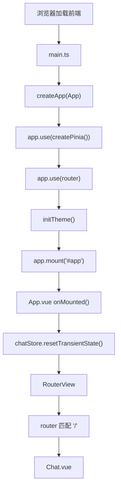
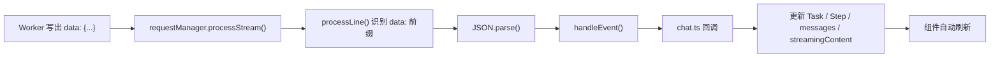

# 前端代码学习指南

> 这份文档按当前仓库的真实实现重写，适合“前端基础还不稳，但愿意顺着项目主链路学”的你。  
> 目标不是背概念，而是让你能顺着代码，真正看懂这个前端为什么这样组织。

## 先给结论

这个项目最适合的学习方式，仍然是：

**前端主线 + 后端辅助**

原因很简单：

- 你真正能看到的结果都先出现在页面上
- 当前前端不是静态页面，而是一个持续接收 SSE 事件、持续更新状态的聊天工作台
- 只要把前端主链路读通，再回头补 Worker，就不会把 Task、Step、Skill、SSE 全看成黑盒

你现在最该建立的，不是“Vue 组件树”心智，而是这条数据流：

```text
main.ts
  -> App.vue
  -> router
  -> Chat.vue
  -> chat store
  -> requestManager
  -> Worker SSE
  -> chat store
  -> ChatHeader / ChatMessages / StepIndicator / ChatInput
```

---

## 1. 先搞清楚这个前端到底在做什么

这个前端不是一个普通“点按钮 -> 调接口 -> 一次性渲染 JSON”的页面。

它当前在做 5 件事：

1. 管理多会话聊天历史
2. 支持文本、图片、文本文件三种输入
3. 通过 SSE 接收后端的任务事件和流式内容
4. 把任务状态、步骤状态、消息状态拆开管理
5. 在页面上把这些状态重新组合成“像工作台”的界面

所以你在页面上看到的内容，本质上来自三类状态：

- 持久化状态：会话列表、消息历史、当前会话
- 运行态状态：当前会话是否在生成、当前 Task、当前 Step 列表
- 展示态状态：当前屏幕正在显示的流式内容、滚动位置、附件托盘显隐

如果你先把这一点记住，后面看代码就不容易乱。

---

## 2. 当前前端目录应该怎么读

建议你先把 `packages/frontend/src` 理解成 10 个功能区：

```text
packages/frontend/src/
├── main.ts                 # 应用入口
├── App.vue                 # 根组件，做应用级初始化
├── router/                 # 路由入口
├── views/                  # 页面级组件
├── components/             # 展示组件与交互组件
├── stores/                 # 聊天主状态与辅助模块
├── composables/            # 可复用逻辑（滚动、主题、输入区等）
├── api/                    # 请求发送与 SSE 解析
├── utils/                  # Markdown、安全、上传、主题核心等工具
├── types/                  # 前后端通信类型
└── styles/                 # tokens / theme / base 三层样式
```

最值得优先读的文件是：

- [`packages/frontend/src/main.ts`](../packages/frontend/src/main.ts)
- [`packages/frontend/src/App.vue`](../packages/frontend/src/App.vue)
- [`packages/frontend/src/router/index.ts`](../packages/frontend/src/router/index.ts)
- [`packages/frontend/src/views/Chat.vue`](../packages/frontend/src/views/Chat.vue)
- [`packages/frontend/src/stores/chat.ts`](../packages/frontend/src/stores/chat.ts)
- [`packages/frontend/src/api/requestManager.ts`](../packages/frontend/src/api/requestManager.ts)

如果你只读组件，不读 Store 和 API，很快就会失去主线。

---

## 3. 启动入口：页面是怎么跑起来的

当前真实启动顺序是：

`main.ts -> App.vue -> router/index.ts -> Chat.vue`

### 3.1 `main.ts` 在做什么

[`packages/frontend/src/main.ts`](../packages/frontend/src/main.ts) 负责：

- 导入全局样式 [`packages/frontend/src/style.css`](../packages/frontend/src/style.css)
- `createApp(App)`
- 注册 `Pinia`
- 注册 `Vue Router`
- 在挂载前调用 `initTheme()`
- 注册全局错误处理和未处理 Promise 拒绝监听
- 开发环境下输出少量调试/性能信息

所以 `main.ts` 是“开机脚本”，不是聊天业务入口。

### 3.2 `App.vue` 为什么比你想象中更重要

[`packages/frontend/src/App.vue`](../packages/frontend/src/App.vue) 模板很薄，只渲染 `<RouterView />`，但它会在挂载时做几件很关键的事：

- 调 `chatStore.resetTransientState()`，清掉刷新后不可能续上的 SSE 运行态
- 监听网络在线/离线状态
- 处理页面可见性变化

也就是说，`App.vue` 不负责聊天布局，但负责“应用级初始化”和“把旧运行态收干净”。

### 3.3 `router/index.ts` 在做什么

[`packages/frontend/src/router/index.ts`](../packages/frontend/src/router/index.ts) 目前只有一条主路由：

- `/` -> `Chat.vue`

它还挂了：

- `beforeEach`
- `afterEach`
- `router.onError`

现在逻辑很轻，但已经留好了未来扩展导航守卫的位置。

### 3.4 启动流程图



---

## 4. 页面骨架：`Chat.vue` 怎么组织整个工作台

[`packages/frontend/src/views/Chat.vue`](../packages/frontend/src/views/Chat.vue) 是真正的聊天页面入口。

它当前做三类事：

1. 组织布局
2. 作为页面协调层转发事件
3. 管理只属于页面展示层的局部状态

### 4.1 你应该先认识哪些组件

| 组件 | 作用 | 为什么重要 |
| --- | --- | --- |
| [`Sidebar.vue`](../packages/frontend/src/components/Sidebar.vue) | 会话列表、新建会话、主题切换 | 会话管理入口 |
| [`ChatHeader.vue`](../packages/frontend/src/components/ChatHeader.vue) | 当前标题、状态、模型、清空按钮 | 当前会话摘要 |
| [`ChatMessages.vue`](../packages/frontend/src/components/ChatMessages.vue) | 欢迎页 / 消息流 / 滚动体验 | 主内容区 |
| [`StepIndicator.vue`](../packages/frontend/src/components/StepIndicator.vue) | 当前任务步骤摘要和展开时间线 | 任务可视化 |
| [`ChatInput.vue`](../packages/frontend/src/components/ChatInput.vue) | 文本、图片、文件、发送/停止 | 输入工作区 |
| [`ErrorBoundary.vue`](../packages/frontend/src/components/ErrorBoundary.vue) | 局部渲染兜底 | 避免局部炸了整页白屏 |
| [`Toast.vue`](../packages/frontend/src/components/Toast.vue) | 存储错误等轻提示 | 应用级反馈 |

### 4.2 `Chat.vue` 本身不保存聊天主状态

页面里真正来自本地 `ref` 的，主要只有：

- `isSidebarOpen`

会话、消息、任务、步骤、流式内容，全都来自：

- `const store = useChatStore()`

这很重要，因为它说明：

- 页面不是状态源
- 页面只是在“读 Store + 传事件”
- 多个组件共享的是同一份聊天主状态

### 4.3 `Chat.vue` 里最值得注意的两个设计

第一个设计：切换会话时只清理展示层流式内容，不直接中止后台任务。

第二个设计：`Sidebar`、`ChatMessages`、`ChatInput + StepIndicator` 都用 `ErrorBoundary` 包了一层。

这两个设计一起说明，这个页面在强调两件事：

- 运行态和展示态要区分
- 局部失败不能拖垮整个聊天工作台

---

## 5. 当前最重要的一层：`chat.ts` 为什么是主脑

[`packages/frontend/src/stores/chat.ts`](../packages/frontend/src/stores/chat.ts) 是整个前端主链路最核心的文件。

### 5.1 先分清两类状态

#### 持久化状态

这些会写进 `localStorage`：

- `sessionList`
- `messagesMap`
- `currentSessionId`

#### 运行态状态

这些只存在于内存里：

- `isLoading`
- `abortController`
- `sessionLoadingMap`
- `currentTaskMap`
- `stepMap`
- `streamingContent`
- `storageError`

这套拆分是当前代码最重要的结构之一。

### 5.2 为什么不是只存一个 `messages`

因为这不是单会话应用。

当前项目的消息结构是：

- `messagesMap[sessionId] = 该会话的消息数组`

对应地，任务和步骤也按会话拆开：

- `currentTaskMap[sessionId]`
- `stepMap[sessionId]`
- `sessionLoadingMap[sessionId]`

这样切换会话时，页面能看见的是“该会话自己的运行态”，而不是全局唯一的一份状态。

### 5.3 Store 被拆成了 4 个文件，各自负责什么

| 文件 | 作用 |
| --- | --- |
| [`chat.ts`](../packages/frontend/src/stores/chat.ts) | 主 Store，对外暴露状态和行为 |
| [`chatStorage.ts`](../packages/frontend/src/stores/chatStorage.ts) | localStorage、体积估算、标题生成、旧消息清理 |
| [`chatRuntime.ts`](../packages/frontend/src/stores/chatRuntime.ts) | 运行态 map 的增删改辅助 |
| [`chatRequest.ts`](../packages/frontend/src/stores/chatRequest.ts) | 请求前整理历史消息 |

这说明当前项目在刻意做一件事：

**把聊天主脑保留在一个 Store 里，但把“存储”“请求拼装”“运行态工具”继续拆薄。**

### 5.4 当前持久化策略也值得你注意

[`chatStorage.ts`](../packages/frontend/src/stores/chatStorage.ts) 当前做了几件很实用的事：

- 保存前估算 `localStorage` 体积
- 超过阈值时裁剪旧消息
- 恢复数据时移除尾部空的 assistant 占位消息
- 标题超长时截断
- 使用防抖降低频繁落盘的开销

这不是“高级技巧”，而是聊天类前端非常现实的工程问题。

---

## 6. 发送一条消息时，前端真正做了什么

当前前端的真实链路是：

`ChatInput -> Chat.vue -> store.sendTaskMessage() -> sendTaskRequest() -> TaskRequestManager -> Worker`

### 6.1 关键步骤不要背错

在 [`chat.ts`](../packages/frontend/src/stores/chat.ts) 的 `sendTaskMessage()` 里，当前顺序大致是：

1. 检查当前会话是否有效
2. 检查该会话是否已经在生成
3. 组装用户消息内容
4. 从 `messagesMap` 构造请求历史
5. 先把用户消息写进当前会话
6. 立刻插入一条空的 assistant 占位消息
7. 创建新的 `AbortController`
8. 清空该会话上一轮的 Task / Step / streamingContent
9. 调 `sendTaskRequest(...)`
10. 在回调里持续更新 Task、Step、消息正文和错误
11. finally 收尾，退出 loading 并落盘

### 6.2 为什么要先插入空 assistant 消息

因为流式内容回来时，前端需要一个明确的目标位置去 append 文本。

也就是说，当前模型不是“生成完再塞进列表”，而是：

- 先预留一条 assistant 消息
- 再把后续 chunk 不断拼到这条消息上

这是看懂流式聊天前端的关键点。

### 6.3 `chatRequest.ts` 的作用

[`packages/frontend/src/stores/chatRequest.ts`](../packages/frontend/src/stores/chatRequest.ts) 会在发请求前：

- 过滤掉空消息
- 过滤掉 `system` 消息
- 只保留 `{ role, content }`
- 再把当前用户消息拼到历史尾部

所以请求给后端的消息数组，不是页面里原封不动的消息数组，而是一份“请求专用整理版”。

---

## 7. 请求层：当前前端怎么解析 SSE

这部分最关键的文件是：

- [`packages/frontend/src/api/task.ts`](../packages/frontend/src/api/task.ts)
- [`packages/frontend/src/api/requestManager.ts`](../packages/frontend/src/api/requestManager.ts)

### 7.1 `task.ts` 只是薄封装

`task.ts` 目前主要是保留一个兼容入口：

- `sendTaskRequest(request, callbacks, signal)`

真正干活的是 `TaskRequestManager`。

### 7.2 `TaskRequestManager` 在做什么

当前 `TaskRequestManager` 负责四件事：

1. `fetch(API_BASE_URL, { stream: true })`
2. 读取 `response.body`
3. 按行解析 SSE 的 `data: ...`
4. 把事件分发到 `onTaskStart / onStepStart / onContent / onError / onComplete`

所以它本质上就是：

**当前前端自己的 SSE 客户端**

### 7.3 当前前端识别的事件有哪些

和 [`packages/frontend/src/types/task.ts`](../packages/frontend/src/types/task.ts) 对齐，当前主要识别：

- `task`
- `step`
- `content`
- `error`
- `complete`

页面上的很多 UI 都是这几类事件驱动的：

- `ChatHeader` 看任务状态和模型
- `StepIndicator` 看步骤流
- `ChatMessages` 看内容流

### 7.4 SSE 流转图



---

## 8. 输入区为什么比表面复杂得多

如果你只看 [`ChatInput.vue`](../packages/frontend/src/components/ChatInput.vue) 的模板，会以为它只是一个文本框加两个上传按钮。

真实情况更复杂。

### 8.1 输入区真正的逻辑集中在 `useChatComposer`

[`packages/frontend/src/composables/useChatComposer.ts`](../packages/frontend/src/composables/useChatComposer.ts) 当前统一管理：

- 输入文本
- 图片草稿
- 已上传文件引用
- 附件托盘显隐
- 上传进度
- 粘贴图片
- 粘贴文本文件
- 发送前图片解析
- 发送后清空输入区

这意味着：

- `ChatInput.vue` 主要负责展示
- `useChatComposer` 负责把“输入区工作流”收口

### 8.2 图片不是一直以 base64 常驻在组件里

当前图片草稿链路是：

- [`ImageUploader.vue`](../packages/frontend/src/components/ImageUploader.vue) 负责加图/删图 UI
- [`draftImageStore.ts`](../packages/frontend/src/utils/draftImageStore.ts) 把草稿图保存到 IndexedDB
- 组件内只保留 `DraftImage`
- 真正发送前，再把草稿解析成 `ImageData`

这套设计的意义是：

- 避免大图片一直常驻响应式状态
- 切会话后还能恢复图片草稿

### 8.3 文件也不是把全文直接塞进聊天消息

当前文件链路是：

- [`FileUploader.vue`](../packages/frontend/src/components/FileUploader.vue) 负责拖拽/选择/展示进度
- [`chunk.ts`](../packages/frontend/src/utils/chunk.ts) 负责分片上传、MD5、断点续传、complete 重试
- 上传完成后前端只保留 `UploadedFileRef`
- 真正的文件内容读取和分析发生在 Worker

所以文档里如果你看到“文件引用”这个词，要理解成：

**前端发给后端的是引用，不是每次都把整份文件正文重新塞进请求。**

### 8.4 当前输入区支持的交互

当前代码里，输入区至少支持：

- Enter 发送
- Shift + Enter 换行
- 粘贴图片
- 粘贴文本文件
- 图片托盘
- 文件托盘
- 正在生成时切换为停止按钮

这也是为什么当前输入区被拆成：

- `ChatInput.vue`
- `ImageUploader.vue`
- `FileUploader.vue`
- `useChatComposer.ts`

---

## 9. 消息列表为什么不只是一个 `v-for`

最值得一起读的文件是：

- [`ChatMessages.vue`](../packages/frontend/src/components/ChatMessages.vue)
- [`ChatMessage.vue`](../packages/frontend/src/components/ChatMessage.vue)
- [`useScroll.ts`](../packages/frontend/src/composables/useScroll.ts)
- [`messageMarkdown.ts`](../packages/frontend/src/utils/messageMarkdown.ts)
- [`safeMarkdown.ts`](../packages/frontend/src/utils/safeMarkdown.ts)

### 9.1 `ChatMessages.vue` 在做什么

它当前负责三件事：

1. 没消息时显示 `ChatWelcome`
2. 有消息时渲染消息流
3. 管理滚动体验

### 9.2 为什么会有 `displayMessages`

因为页面真正展示的消息，不总是等于 `store.messages`。

当前逻辑是：

- `store.messages` 是原始会话消息
- 如果某条消息正在流式生成，就用 `streamingContent` 覆盖其展示内容
- 得到一个专门用于渲染的 `displayMessages`

这就是“存储态”和“展示态”分离的体现。

### 9.3 当前消息区已经带了滚动优化

[`useScroll.ts`](../packages/frontend/src/composables/useScroll.ts) 当前提供：

- 自动滚到底
- 是否在底部判断
- 回顶部
- 平滑滚动

同一个文件里还有 `useVirtualScroll()`，而 [`ChatMessages.vue`](../packages/frontend/src/components/ChatMessages.vue) 会在消息数很多时启用虚拟滚动。

所以这已经不是一个简单聊天列表，而是：

**带长列表性能考虑的消息流组件**

### 9.4 Markdown 渲染也做了安全处理

当前消息渲染链路是：

- `ChatMessage.vue` 调 `renderMessageMarkdown()`
- `messageMarkdown.ts` 构造代码块、复制按钮
- `safeMarkdown.ts` 负责：
  - 禁止原始 HTML 直通
  - 转义文本和属性
  - 清洗危险协议链接

所以你应该把这套理解成：

**不是“把 Markdown 丢进组件里就完了”，而是专门做了一层安全渲染器。**

---

## 10. 样式、主题和稳定性，当前是怎么组织的

### 10.1 样式入口很清晰

[`packages/frontend/src/style.css`](../packages/frontend/src/style.css) 当前只做三层引入：

- [`styles/tokens.css`](../packages/frontend/src/styles/tokens.css)
- [`styles/theme.css`](../packages/frontend/src/styles/theme.css)
- [`styles/base.css`](../packages/frontend/src/styles/base.css)

你可以这样理解：

- `tokens`：设计变量
- `theme`：主题映射
- `base`：全局基础样式

### 10.2 主题不是写死在组件里的

当前主题逻辑主要在：

- [`useTheme.ts`](../packages/frontend/src/composables/useTheme.ts)
- [`themeCore.ts`](../packages/frontend/src/utils/themeCore.ts)

`main.ts` 在应用启动前会 `initTheme()`，`Sidebar.vue` 里再通过 `useTheme()` 切换主题。

也就是说，主题切换是一个独立能力，不是某个组件各自改 class。

### 10.3 当前前端做了哪些稳定性兜底

当前项目在前端稳定性上，至少做了这些事：

- `App.vue` 挂载时清理旧运行态
- `main.ts` 注册 `window.error`、`unhandledrejection`、Vue `errorHandler`
- `Chat.vue` 用 `ErrorBoundary` 包住侧边栏、消息区、输入区
- `Toast` 用来显示 `storageError`

所以当前前端的目标不是“页面跑起来就行”，而是尽量做到：

- 出问题时别整页白屏
- 刷新后别留假 loading
- 存储爆了要给用户反馈

---

## 11. 如果你要顺着代码读，推荐这个顺序

### 第 1 天：先把启动和页面骨架读通

先看：

- [`main.ts`](../packages/frontend/src/main.ts)
- [`App.vue`](../packages/frontend/src/App.vue)
- [`router/index.ts`](../packages/frontend/src/router/index.ts)
- [`views/Chat.vue`](../packages/frontend/src/views/Chat.vue)

目标：

- 知道页面是怎么挂起来的
- 知道 `Chat.vue` 负责哪些区域

### 第 2 天：看懂页面上每块区域是谁负责的

先看：

- [`Sidebar.vue`](../packages/frontend/src/components/Sidebar.vue)
- [`ChatHeader.vue`](../packages/frontend/src/components/ChatHeader.vue)
- [`ChatMessages.vue`](../packages/frontend/src/components/ChatMessages.vue)
- [`StepIndicator.vue`](../packages/frontend/src/components/StepIndicator.vue)
- [`ChatInput.vue`](../packages/frontend/src/components/ChatInput.vue)

目标：

- 分清哪些组件在展示，哪些组件在协调

### 第 3 天：重点攻克 Store

先看：

- [`stores/chat.ts`](../packages/frontend/src/stores/chat.ts)
- [`stores/chatStorage.ts`](../packages/frontend/src/stores/chatStorage.ts)
- [`stores/chatRuntime.ts`](../packages/frontend/src/stores/chatRuntime.ts)
- [`stores/chatRequest.ts`](../packages/frontend/src/stores/chatRequest.ts)
- [`types/task.ts`](../packages/frontend/src/types/task.ts)

目标：

- 看懂“持久化状态”和“运行态状态”的区别

### 第 4 天：打通请求和事件流

先看：

- [`api/task.ts`](../packages/frontend/src/api/task.ts)
- [`api/requestManager.ts`](../packages/frontend/src/api/requestManager.ts)
- [`packages/worker/src/handlers/chatHandlers.ts`](../packages/worker/src/handlers/chatHandlers.ts)
- [`packages/worker/src/core/taskManager.ts`](../packages/worker/src/core/taskManager.ts)

目标：

- 能说清楚一条 `content` 事件是怎么回到前端的

### 第 5 天：补输入区、滚动和 Markdown

先看：

- [`composables/useChatComposer.ts`](../packages/frontend/src/composables/useChatComposer.ts)
- [`components/FileUploader.vue`](../packages/frontend/src/components/FileUploader.vue)
- [`components/ImageUploader.vue`](../packages/frontend/src/components/ImageUploader.vue)
- [`composables/useScroll.ts`](../packages/frontend/src/composables/useScroll.ts)
- [`utils/messageMarkdown.ts`](../packages/frontend/src/utils/messageMarkdown.ts)
- [`utils/safeMarkdown.ts`](../packages/frontend/src/utils/safeMarkdown.ts)

目标：

- 把“表面看起来简单，实际比较工程化”的那一层吃透

---

## 12. 学完这份文档后的合格标准

如果你现在能回答下面这些问题，说明这份指南已经起作用了：

- `main.ts -> App.vue -> router -> Chat.vue` 这条入口你能讲清
- 你知道 `Chat.vue` 为什么是协调层，而不是状态中心
- 你能说清 `sessionList / messagesMap / currentTaskMap / stepMap / streamingContent` 各自描述什么
- 你能说清为什么发送前要先插入一条空 assistant 占位消息
- 你能说清当前图片草稿为什么走 IndexedDB，文件为什么只保留引用
- 你能说清 `requestManager` 如何解析 SSE
- 你能说清 `ChatMessages.vue` 为什么需要 `displayMessages`

如果这些问题你都能说清，就说明你已经不是“在看组件热闹”，而是真正开始理解这个前端的主链路了。

## 继续往下学

- 想继续补后端：看 [`docs/backend-learning-guide.md`](./backend-learning-guide.md)
- 想继续补 Vue 基础：只围绕这几个关键词补就够了

```text
ref
computed
watch
props / emits
Pinia
ReadableStream
AbortController
```

- 想继续补样式：重点回看

```text
flex
min-width: 0
overflow
position: sticky
CSS variables
```
